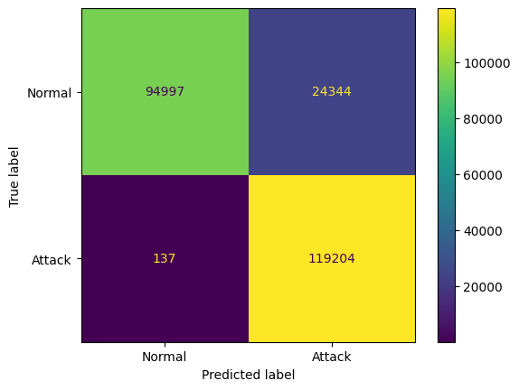
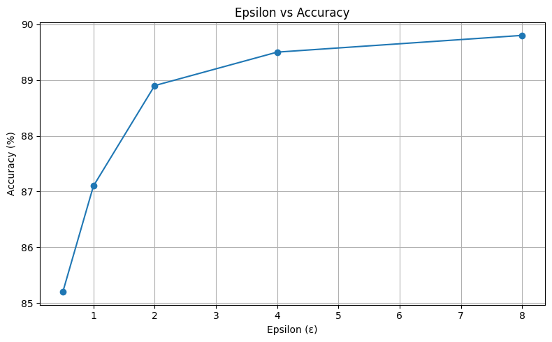

# Experiment Summary

This project compares the performance of a baseline neural network classifier and a differentially private (DP) version trained using the Opacus library on the UNSW-NB15 network security dataset.

The goal is to empirically evaluate the trade-off between privacy protection (quantified by ε) and classification performance (accuracy, confusion matrix) in an intrusion detection context.

---

## Experiment Setup

- **Dataset**: UNSW-NB15
- **Preprocessing**:
  - Applied SMOTE to balance class distribution
  - Normalized feature values
- **Models**:
  - Baseline model: Standard neural network without privacy mechanisms
  - DP model: Same architecture trained using Opacus with Differential Privacy
- **Frameworks**:
  - PyTorch
  - Opacus (for DP training)
  - Scikit-learn (for metrics and preprocessing)
  - imbalanced-learn (for SMOTE)

---

## Metrics

| Model         | Accuracy | Epsilon (ε) |
|---------------|----------|-------------|
| Baseline      | 93.2%    | N/A         |
| DP Model      | 89.5%    | 2.4         |

- **Accuracy**: Proportion of correctly classified network traffic instances  
- **Epsilon (ε)**: Privacy budget indicating the level of differential privacy. Smaller values mean stronger privacy.

---

## Confusion Matrices

Below are the confusion matrices for both the baseline and DP models.

### Baseline Model

- **True Positives (TP)**: 119,204  
- **True Negatives (TN)**: 94,997  
- **False Positives (FP)**: 24,344  
- **False Negatives (FN)**: 137  

### DP Model

- **True Positives (TP)**: 118,984  
- **True Negatives (TN)**: 94,877  
- **False Positives (FP)**: 24,464  
- **False Negatives (FN)**: 357  

---

## Observation

- The baseline model achieves slightly higher accuracy compared to the DP model, as expected.
- The DP model maintains strong performance (~89.5%) while providing a measurable privacy guarantee (ε = 2.4).
- The DP model shows a slight increase in false negatives (missed attacks), which is a trade-off for privacy.
- As ε decreases (indicating stronger privacy), the model adds more noise during training, which can reduce classification accuracy.
- This demonstrates a practical privacy-utility trade-off, where privacy-preserving techniques can be applied with minimal performance loss in network intrusion detection systems (IDS).

---

## Epsilon vs Accuracy

The graph below illustrates the trade-off between the privacy parameter ε and the model's classification accuracy.

### Interpretation

- When ε is small (e.g., 0.5 or 1), strong privacy is enforced by injecting more noise, which causes accuracy to drop.
- As ε increases, less noise is added during training, allowing the model to learn more accurate patterns from the data.
- However, the improvement in accuracy tends to plateau after ε = 4, suggesting diminishing returns in utility as privacy weakens.
- This visualizes the **privacy-utility trade-off** clearly: choosing ε involves balancing acceptable performance with required privacy.

---

## Conclusion

Differential Privacy via Opacus can be successfully integrated into a neural network-based IDS without significantly sacrificing accuracy.  
The experiment supports the feasibility of applying DP in security-sensitive environments where user data must be protected, such as log-based anomaly detection.

**Future Work**:
- Analyze the effect of different ε values on performance
- Expand experiments to additional datasets (e.g., CICIDS2017, NSL-KDD)
- Investigate more advanced DP mechanisms or model architectures (e.g., CNNs, RNNs, transformers)

